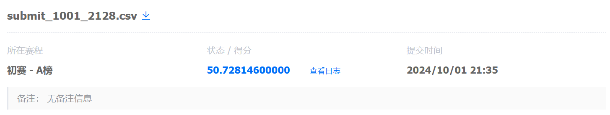

# DS 课程项目：基于运营商文本数据的知识库检索 - 比赛

比赛链接：https://www.datafountain.cn/competitions/1045

比赛任务：使用运营商相关的文档构建知识库，根据用户问题检索知识库并返回答案所在的文本块。

一些重要的比赛要求：

- **主办方限定选手应使用向量模型 “bge-large-zh-v1.5” 进行文本向量化，不允许微调！**

- **主办方特别说明**：本赛题意在优化 RAG 中除 “LLM 答案生成及之后部分” 的流程（参考下图蓝框，也就是对 Retrieval 的准确度进行优化），意在**消除大模型的使用对大家的不公平性**。选手应重点关注**文本解析**、**文本切片**、**检索过滤排序**等环节。

    <center></center>

- **禁止使用 LLM 直接生成最终答案 !!!**
    - 在分块、重排等过程中可以使用公开库和模型
    - 禁止使用 LLM 继续调整精排得到的文本块，如压缩文本块长度
    - 禁止使用 LLM 直接从文档获取问题答案
    - **个人理解：提交的答案不能是 LLM 输出的内容**

- **不允许使用外部信息回答问题 !!!**

- 所有人工标注的答案文本块至少为**文档中的一个完整句子**，选手可以参考该规则返回文本块。

- 更多要求请阅读：[常见问题 - 赛题要求](https://www.datafountain.cn/competitions/1045/faq#_0)

- 有疑问可在赛题微信交流群里咨询：[赛制规则 - 交流社群](https://www.datafountain.cn/competitions/1045#_74)


比赛关键时间节点，请大家注意：

|2024/11/08（12:00）|截止报名组队|
|:-|:-|
|**2024/11/13（24:00）**|**A 榜提交截止**|
|**2024/11/14**|**B 榜测试集公布（必须在 11月14日 24:00 前下载）**|
|**2024/11/15（00:00-24:00）**|**B 榜提交（必须在一天内提交）**|
|**2024/12/09-12/13**|**B 榜前 5 名线上决赛评审**|
|**2024/12/28-12/29**|**线下评审、颁奖典礼**|


## ¶ 比赛解读

> 只是提供个人解读，给大家参考，大家不要被局限住。可以尝试完全不同的方案。

### 1. 比赛方案

根据主办方提供的 **“特别说明”**，使用一般 RAG 框架中除 “LLM 答案生成及之后部分” 的流程作为 pipeline，参考下图蓝框。

<center></center>

基础 Pipeline 如下：

- ① 文档解析：将运营商相关的 PDF 文档解析为文本数据。

- ② 文本切片/分块

- ③ 构建向量数据库：使用向量模型计算出每个文本块的表示向量，并存储到向量数据库中

- ④ 根据问题检索答案：涉及过滤、相似度计算、排序，通常会检索多条与问题相关性高的文本，然后以某种策略从这些检索到的文本中得到问题的答案。


其中，**文档解析方法(①)、文本分块方法(②)、以及 检索策略(④) 都有较大的探索空间。**

对文本进行合理的分块以及将检索到的多条文本进行拼接都是比较 promising 的提分点，因为：
- “所有问题的答案都可以在文档原文中找到” ———— [赛题任务 A/B 榜说明](https://www.datafountain.cn/competitions/1045/datasets#_0)
- “有人工标注的答案文本块至少为**文档中的一个完整句子**，选手可以参考该规则返回文本块” ———— [常见问题 - 赛题要求](https://www.datafountain.cn/competitions/1045/faq#_0)


关于使用 LLM：

- 当然，在条件允许的情况下，可以将 “检索到的多条文本 + 问题” 写入 Prompt Template，然后输入到 LLM 中做推理，输出一个更加综合自然的回答，**但赛题要求不能将这个回答作为答案**，所以可以将这个回答作为 reference，计算与 Top-K 文本的相似度，并对 Top-K 文本进行重排，将 Top-1 文本作为答案。

- 这里只是一种使用 LLM 的思路，并且存在犯规风险，大家还是**重点探索 ① ② ④** 或是将 LLM/一些公开模型 用在其他地方。至于微调 LLM ，个人认为不太需要。


### 2. 方案 demo

我用当前比较火的开源 RAG 框架 [``LangChain``](https://github.com/langchain-ai/langchain) 搭建了一个简单的 pipeline，供大家参考：[demo.ipynb](./demo.ipynb)。

🚀 demo 中还给出了流程中每一步的 **改进建议**，大家没有思路时可以尝试。

🚀 可以阅读 [相关 Survey](#2023-2024-最新-rag-survey) 来寻找每一步的实现或改进思路，还可以使用 [其他开源框架](#github-上比较流行的开源-rag-框架) 来搭建 pipeline。

此外，一些比赛选手在 [交流讨论](https://www.datafountain.cn/competitions/1045/discuss) 版块中分享了自己的方案代码。大家可以参考，但注意**不要拿来原封不动地运行，然后提交答案，因为会被检查出作弊**！

💻 在运行 demo 前，需要新建一个 python 环境 或 在已有 python 环境中下载相应 Package：

```commandline
conda create -n rag python=3.9

conda activate rag

conda install jupyter notebook pandas

pip install pdfplumber modelscope langchain langchain-community sentence_transformer faiss-cpu -i https://pypi.tuna.tsinghua.edu.cn/simple
```

💻 硬件方面，最好有一张 **3G** 显存的 GPU 显卡来部署向量模型，用 CPU 应该会较慢。

🧐 这个方案（最简易版本）的 A 榜得分，还有很大提升空间：

<center></center>


### 3. 对评价指标的理解

- 对于每一道题，找对关键词、找对向量，是最重要的，所以使用 LLM 对指标的影响不大。

- 注意 answer 的长度不能太长，否则会被惩罚。

- 每道题有对应的难度系数分，针对难度较高题目的一些特点进行改进，是一个提分点。

<center></center>


## ¶ 参考阅读

### 2023-2024 最新 RAG Survey：

- [Gao, Yunfan, et al. "Retrieval-augmented generation for large language models: A survey." arXiv preprint arXiv:2312.10997 (2023).](https://arxiv.org/pdf/2312.10997)
- [Zhao, Penghao, et al. "Retrieval-augmented generation for ai-generated content: A survey." arXiv preprint arXiv:2402.19473 (2024).](https://arxiv.org/pdf/2402.19473)
- [Zhao, Siyun, et al. "Retrieval Augmented Generation (RAG) and Beyond: A Comprehensive Survey on How to Make your LLMs use External Data More Wisely." arXiv preprint arXiv:2409.14924 (2024).](https://arxiv.org/pdf/2409.14924)

### Github 上比较流行的开源 RAG 框架：

- [LangChain](https://github.com/langchain-ai/langchain) - 93k⭐
- [RAGFlow](https://github.com/infiniflow/ragflow) - 19k⭐
- [QAnything](https://github.com/netease-youdao/QAnything) - 11k⭐
- [GoMate](https://github.com/gomate-community/GoMate) - 0.4k⭐

### 其他

- [[CSDN] 一文彻底搞定 RAG、知识库、 Llama-3！！](https://blog.csdn.net/xiangxueerfei/article/details/139304577#:~:text=%E6%A3%80%E7%B4%A2%E5%A2%9E%E5%BC%BA%E7%94%9F%E6%88%90%EF%BC%88Ret)
